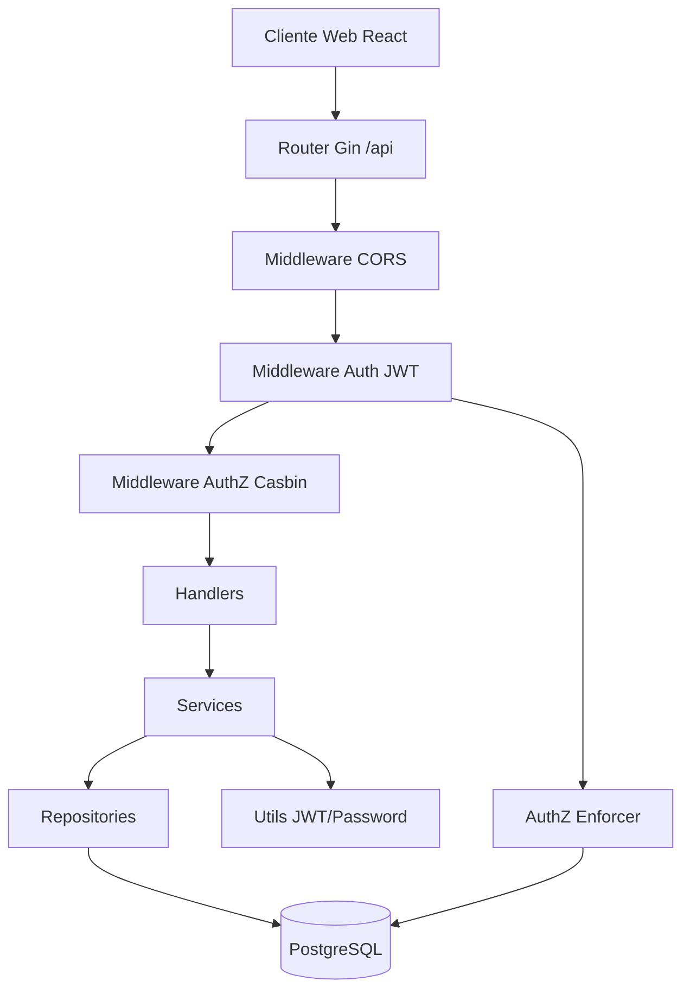
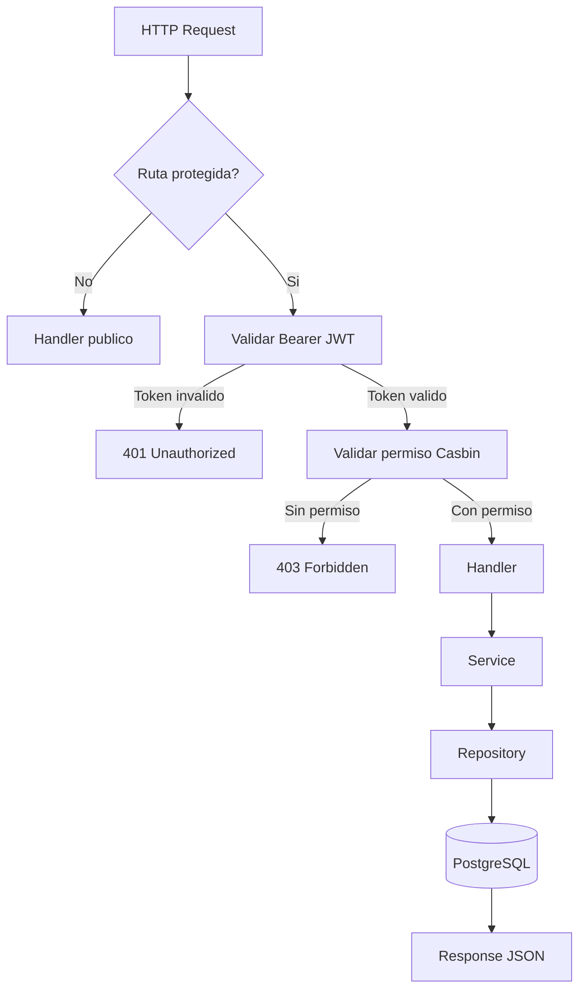
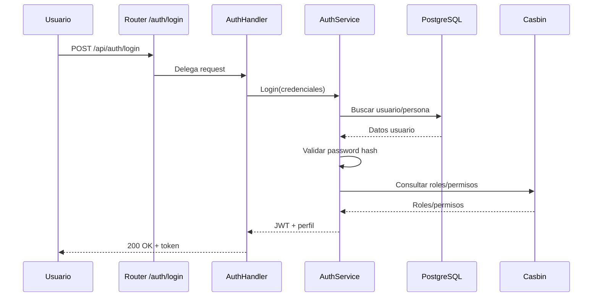
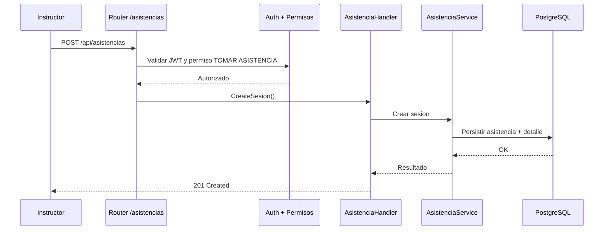

# Arquitectura - Diagramas

## Diagrama de componentes

```mermaid
graph TD
    A[Cliente Web React] --> B[Router Gin /api]
    B --> C[Middleware CORS]
    C --> D[Middleware Auth JWT]
    D --> E[Middleware AuthZ Casbin]
    E --> F[Handlers]
    F --> G[Services]
    G --> H[Repositories]
    H --> I[(PostgreSQL)]
    G --> J[Utils JWT/Password]
    D --> K[AuthZ Enforcer]
    K --> I
```

## Diagrama de flujo de solicitud autenticada

```mermaid
flowchart TD
    A[HTTP Request] --> B{Ruta protegida?}
    B -- No --> C[Handler publico]
    B -- Si --> D[Validar Bearer JWT]
    D -->|Token invalido| E[401 Unauthorized]
    D -->|Token valido| F[Validar permiso Casbin]
    F -->|Sin permiso| G[403 Forbidden]
    F -->|Con permiso| H[Handler]
    H --> I[Service]
    I --> J[Repository]
    J --> K[(PostgreSQL)]
    K --> L[Response JSON]
```

## Diagrama de secuencia - Login

```mermaid
sequenceDiagram
    participant U as Usuario
    participant R as Router /auth/login
    participant H as AuthHandler
    participant S as AuthService
    participant DB as PostgreSQL
    participant C as Casbin

    U->>R: POST /api/auth/login
    R->>H: Delega request
    H->>S: Login(credenciales)
    S->>DB: Buscar usuario/persona
    DB-->>S: Datos usuario
    S->>S: Validar password hash
    S->>C: Consultar roles/permisos
    C-->>S: Roles/permisos
    S-->>H: JWT + perfil
    H-->>U: 200 OK + token
```

## Diagrama de secuencia - Registro de asistencia

```mermaid
sequenceDiagram
    participant I as Instructor
    participant R as Router /asistencias
    participant M as Auth + Permisos
    participant H as AsistenciaHandler
    participant S as AsistenciaService
    participant DB as PostgreSQL

    I->>R: POST /api/asistencias
    R->>M: Validar JWT y permiso TOMAR ASISTENCIA
    M-->>R: Autorizado
    R->>H: CreateSesion()
    H->>S: Crear sesion
    S->>DB: Persistir asistencia + detalle
    DB-->>S: OK
    S-->>H: Resultado
    H-->>I: 201 Created
```
