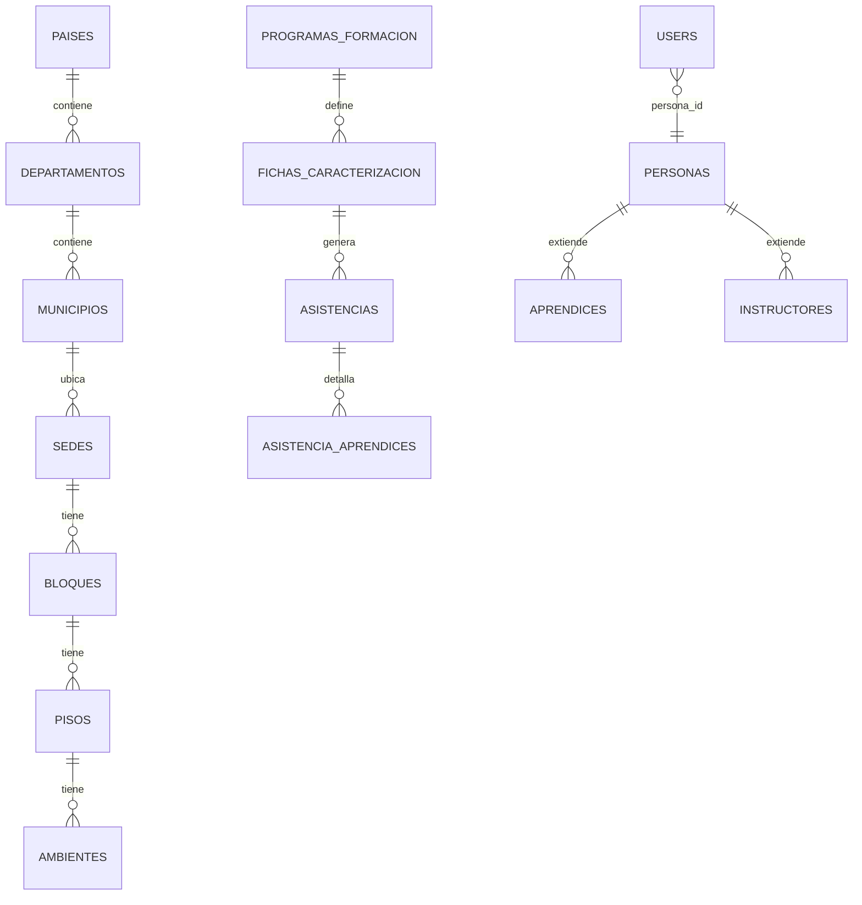

# Base de Datos - Relaciones

## Relaciones principales (alto impacto funcional)

- `pais` 1-N `departamentos`
- `departamento` 1-N `municipios`
- `municipio` 1-N `sedes` y `personas`
- `sede` 1-N `bloques`
- `bloque` 1-N `pisos`
- `piso` 1-N `ambientes`
- `programa_formacion` 1-N `fichas_caracterizacion`
- `ficha_caracterizacion` 1-N `aprendices` (via asignaciones)
- `ficha_caracterizacion` 1-N `instructor_ficha_caracterizacion`
- `asistencia` 1-N `asistencia_aprendices`
- `persona` 1-(0..1) `users` (esperado funcionalmente; validar constraint fisica en BD)

## Relaciones N-N relevantes

- `resultados_aprendizajes` N-N `competencias`
- `guias_aprendizaje` N-N `resultados_aprendizajes`
- `guias_aprendizaje` N-N `evidencias`
- `asistencia_aprendices` N-N `tipos_observacion_asistencia`

## Diagrama ER (Mermaid)

## Consideraciones de integridad

- Aplicar llaves foraneas en todas las relaciones criticas.
- Definir indices para columnas de filtro frecuente (ficha, fecha, persona, estado).
- Verificar constraints de unicidad para relaciones que deben ser 1-1 (ej. usuario-persona).
